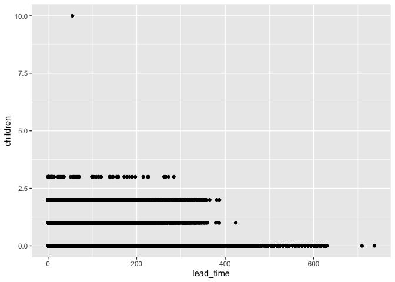

Lesson 3: Filters and Plots
================

## Background for this activity

In this activity, you’ll review a scenario, and practice creating a data
visualization with ggplot2. You will learn how to make use of the
filters and facets features of ggplot2 to create custom visualizations
based on different criteria.

Throughout this activity, you will also have the opportunity to practice
writing your own code by making changes to the code chunks yourself. If
you encounter an error or get stuck, you can always check the
Lesson3_Filters_Solutions .rmd file in the Solutions folder under Week 4
for the complete, correct code.

## The Scenario

As a junior data analyst for a hotel booking company, you have been
asked to clean hotel booking data, create visualizations with `ggplot2`
to gain insight into the data, and present different facets of the data
through visualization. Now, you are going to build on the work you
performed previously to apply filters to your data visualizations in
`ggplot2`.

## Step 1: Import your data

If you haven’t exited out of RStudio since importing this data last
time, you can skip these steps. Rerunning these code chunks won’t affect
your console if you want to run them just in case, though.

If this line causes an error, copy in the line setwd(“projects/Course
7/Week 4”) before it.

Run the code below to read in the file ‘hotel_bookings.csv’ into a data
frame:

``` r
hotel_bookings <- read.csv("hotel_bookings.csv")
```

## Step 2: Refresh Your Memory

By now, you are pretty familiar with this data set. But you can refresh
your memory with the `head()` and `colnames()` functions. Run two code
chunks below to get at a sample of the data and also preview all the
column names:

``` r
head(hotel_bookings)
```

    ##          hotel is_canceled lead_time arrival_date_year arrival_date_month
    ## 1 Resort Hotel           0       342              2015               July
    ## 2 Resort Hotel           0       737              2015               July
    ## 3 Resort Hotel           0         7              2015               July
    ## 4 Resort Hotel           0        13              2015               July
    ## 5 Resort Hotel           0        14              2015               July
    ## 6 Resort Hotel           0        14              2015               July
    ##   arrival_date_week_number arrival_date_day_of_month stays_in_weekend_nights
    ## 1                       27                         1                       0
    ## 2                       27                         1                       0
    ## 3                       27                         1                       0
    ## 4                       27                         1                       0
    ## 5                       27                         1                       0
    ## 6                       27                         1                       0
    ##   stays_in_week_nights adults children babies meal country market_segment
    ## 1                    0      2        0      0   BB     PRT         Direct
    ## 2                    0      2        0      0   BB     PRT         Direct
    ## 3                    1      1        0      0   BB     GBR         Direct
    ## 4                    1      1        0      0   BB     GBR      Corporate
    ## 5                    2      2        0      0   BB     GBR      Online TA
    ## 6                    2      2        0      0   BB     GBR      Online TA
    ##   distribution_channel is_repeated_guest previous_cancellations
    ## 1               Direct                 0                      0
    ## 2               Direct                 0                      0
    ## 3               Direct                 0                      0
    ## 4            Corporate                 0                      0
    ## 5                TA/TO                 0                      0
    ## 6                TA/TO                 0                      0
    ##   previous_bookings_not_canceled reserved_room_type assigned_room_type
    ## 1                              0                  C                  C
    ## 2                              0                  C                  C
    ## 3                              0                  A                  C
    ## 4                              0                  A                  A
    ## 5                              0                  A                  A
    ## 6                              0                  A                  A
    ##   booking_changes deposit_type agent company days_in_waiting_list customer_type
    ## 1               3   No Deposit  NULL    NULL                    0     Transient
    ## 2               4   No Deposit  NULL    NULL                    0     Transient
    ## 3               0   No Deposit  NULL    NULL                    0     Transient
    ## 4               0   No Deposit   304    NULL                    0     Transient
    ## 5               0   No Deposit   240    NULL                    0     Transient
    ## 6               0   No Deposit   240    NULL                    0     Transient
    ##   adr required_car_parking_spaces total_of_special_requests reservation_status
    ## 1   0                           0                         0          Check-Out
    ## 2   0                           0                         0          Check-Out
    ## 3  75                           0                         0          Check-Out
    ## 4  75                           0                         0          Check-Out
    ## 5  98                           0                         1          Check-Out
    ## 6  98                           0                         1          Check-Out
    ##   reservation_status_date
    ## 1              2015-07-01
    ## 2              2015-07-01
    ## 3              2015-07-02
    ## 4              2015-07-02
    ## 5              2015-07-03
    ## 6              2015-07-03

``` r
colnames(hotel_bookings)
```

    ##  [1] "hotel"                          "is_canceled"                   
    ##  [3] "lead_time"                      "arrival_date_year"             
    ##  [5] "arrival_date_month"             "arrival_date_week_number"      
    ##  [7] "arrival_date_day_of_month"      "stays_in_weekend_nights"       
    ##  [9] "stays_in_week_nights"           "adults"                        
    ## [11] "children"                       "babies"                        
    ## [13] "meal"                           "country"                       
    ## [15] "market_segment"                 "distribution_channel"          
    ## [17] "is_repeated_guest"              "previous_cancellations"        
    ## [19] "previous_bookings_not_canceled" "reserved_room_type"            
    ## [21] "assigned_room_type"             "booking_changes"               
    ## [23] "deposit_type"                   "agent"                         
    ## [25] "company"                        "days_in_waiting_list"          
    ## [27] "customer_type"                  "adr"                           
    ## [29] "required_car_parking_spaces"    "total_of_special_requests"     
    ## [31] "reservation_status"             "reservation_status_date"

## Step 3: Install and load the ‘ggplot2’ package (optional)

If you haven’t already installed and loaded the `ggplot2` package, you
will need to do that before you can use the `ggplot()` function. You
only have to do this once though, not every time you call `ggplot()`.

You can also skip this step if you haven’t closed your RStudio account
since doing the last activity. If you aren’t sure, you can run the code
chunk and hit ‘cancel’ if the warning message pops up telling you that
have already downloaded the `ggplot2` package.

Run the code chunk below to install and load `ggplot2`. This may take a
few minutes!

## Step 4: Making many different charts

Earlier, you created a scatterplot to explore the relationship between
booking lead time and guests traveling with children. As a refresher,
here’s the code:

``` r
ggplot(data = hotel_bookings) +
  geom_point(mapping = aes(x = lead_time, y = children))
```

    ## Warning: Removed 4 rows containing missing values (`geom_point()`).

<!-- -->

Your stakeholder asked about the group of guests who typically make
early bookings, and this plot showed that many of these guests do not
have children.

Now, your stakeholder wants to run a family-friendly promotion targeting
key market segments. She wants to know which market segments generate
the largest number of bookings, and where these bookings are made (city
hotels or resort hotels).

First, you decide to create a bar chart showing each hotel type and
market segment. You use different colors to represent each market
segment:

``` r
ggplot(data = hotel_bookings) +
  geom_bar(mapping = aes(x = hotel, fill = market_segment))
```

<!-- -->

The geom_bar() function uses bars to create a bar chart. The chart has
‘hotel’ on the x-axis and ‘count’ on the y-axis (note: if you don’t
specify a variable for the y-axis, the code defaults to ‘count’). The
code maps the ‘fill’ aesthetic to the variable ‘market_segment’ to
generate color-coded sections inside each bar.

After creating this bar chart, you realize that it’s difficult to
compare the size of the market segments at the top of the bars. You want
your stakeholder to be able to clearly compare each segment.

You decide to use the facet_wrap() function to create a separate plot
for each market segment. In the parentheses of the facet_wrap()
function, add the variable ‘market_segment’ after the tilde symbol (\~):

``` r
ggplot(data = hotel_bookings) +
  geom_bar(mapping = aes(x = hotel, fill = deposit_type )) +
  facet_wrap(~market_segment)
```

<!-- -->

Now you have a separate bar chart for each market segment. Your
stakeholder has a clearer idea of the size of each market segment, as
well as the corresponding data for each hotel type.

## Step 5: Filtering

For the next step, you will need to have the `tidyverse` package
installed and loaded. You may see a pop-up asking if you want to
install; if that’s the case, click ‘Install.’ This may take a few
minutes!

If you have already done this because you’re using the `tidyverse`
package on your own, you can skip this code chunk.

``` r
#install.packages('tidyverse')
library(tidyverse)
```

    ## ── Attaching packages ─────────────────────────────────────── tidyverse 1.3.2 ──
    ## ✔ tibble  3.1.8     ✔ dplyr   1.1.0
    ## ✔ tidyr   1.3.0     ✔ stringr 1.5.0
    ## ✔ readr   2.1.4     ✔ forcats 1.0.0
    ## ✔ purrr   1.0.1     
    ## ── Conflicts ────────────────────────────────────────── tidyverse_conflicts() ──
    ## ✖ dplyr::filter() masks stats::filter()
    ## ✖ dplyr::lag()    masks stats::lag()

After considering all the data, your stakeholder decides to send the
promotion to families that make online bookings for city hotels. The
online segment is the fastest growing segment, and families tend to
spend more at city hotels than other types of guests.

Your stakeholder asks if you can create a plot that shows the
relationship between lead time and guests traveling with children for
online bookings at city hotels. This will give her a better idea of the
specific timing for the promotion.

You think about it, and realize you have all the tools you need to
fulfill the request. You break it down into the following two steps: 1)
filtering your data; 2) plotting your filtered data.

For the first step, you can use the `filter()` function to create a data
set that only includes the data you want. Input ‘City Hotel’ in the
first set of quotation marks and ‘Online TA’ in the second set of
quotations marks to specify your criteria:

``` r
onlineta_city_hotels <- filter(hotel_bookings, 
                           (hotel=="City Hotel" & 
                             hotel_bookings$market_segment=="Online TA"))
```

Note that you can use the ‘&’ character to demonstrate that you want two
different conditions to be true. Also, you can use the ‘\$’ character to
specify which column in the data frame ‘hotel_bookings’ you are
referencing (for example, ‘market_segment’).

You can use the`View`() function to check out your new data frame:

``` r
head(onlineta_city_hotels)
```

    ##        hotel is_canceled lead_time arrival_date_year arrival_date_month
    ## 1 City Hotel           1        88              2015               July
    ## 2 City Hotel           1        65              2015               July
    ## 3 City Hotel           1        92              2015               July
    ## 4 City Hotel           1       100              2015               July
    ## 5 City Hotel           1        79              2015               July
    ## 6 City Hotel           1        63              2015               July
    ##   arrival_date_week_number arrival_date_day_of_month stays_in_weekend_nights
    ## 1                       27                         1                       0
    ## 2                       27                         1                       0
    ## 3                       27                         1                       2
    ## 4                       27                         2                       0
    ## 5                       27                         2                       0
    ## 6                       27                         2                       1
    ##   stays_in_week_nights adults children babies meal country market_segment
    ## 1                    4      2        0      0   BB     PRT      Online TA
    ## 2                    4      1        0      0   BB     PRT      Online TA
    ## 3                    4      2        0      0   BB     PRT      Online TA
    ## 4                    2      2        0      0   BB     PRT      Online TA
    ## 5                    3      2        0      0   BB     PRT      Online TA
    ## 6                    3      1        0      0   BB     PRT      Online TA
    ##   distribution_channel is_repeated_guest previous_cancellations
    ## 1                TA/TO                 0                      0
    ## 2                TA/TO                 0                      0
    ## 3                TA/TO                 0                      0
    ## 4                TA/TO                 0                      0
    ## 5                TA/TO                 0                      0
    ## 6                TA/TO                 0                      0
    ##   previous_bookings_not_canceled reserved_room_type assigned_room_type
    ## 1                              0                  A                  A
    ## 2                              0                  A                  A
    ## 3                              0                  A                  A
    ## 4                              0                  A                  A
    ## 5                              0                  A                  A
    ## 6                              0                  A                  A
    ##   booking_changes deposit_type agent company days_in_waiting_list customer_type
    ## 1               0   No Deposit     9    NULL                    0     Transient
    ## 2               0   No Deposit     9    NULL                    0     Transient
    ## 3               0   No Deposit     9    NULL                    0     Transient
    ## 4               0   No Deposit     9    NULL                    0     Transient
    ## 5               0   No Deposit     9    NULL                    0     Transient
    ## 6               0   No Deposit     9    NULL                    0     Transient
    ##    adr required_car_parking_spaces total_of_special_requests reservation_status
    ## 1 76.5                           0                         1           Canceled
    ## 2 68.0                           0                         1           Canceled
    ## 3 76.5                           0                         2           Canceled
    ## 4 76.5                           0                         1           Canceled
    ## 5 76.5                           0                         1           Canceled
    ## 6 68.0                           0                         0           Canceled
    ##   reservation_status_date
    ## 1              2015-07-01
    ## 2              2015-04-30
    ## 3              2015-06-23
    ## 4              2015-04-02
    ## 5              2015-06-25
    ## 6              2015-06-25

There is also another way to do this. You can use the pipe operator
(%\>%) to do this in steps!

You name this data frame `onlineta_city_hotels_v2`:

``` r
onlineta_city_hotels_v2 <- hotel_bookings %>%
  filter(hotel=="City Hotel") %>%
  filter(market_segment=="Online TA")
```

Notice how in the code chunk above, the %\>% symbol is used to note the
logical steps of this code. First, it starts with the name of the data
frame, `onlineta_city_hotels_v2`, AND THEN it tells `R` to start with
the original data frame `hotel_bookings`. Then it tells it to filter on
the ‘hotel’ column; finally, it tells it to filter on the
‘market_segment’ column.

This code chunk generates the same data frame by using the `View()`
function:

``` r
head(onlineta_city_hotels_v2)
```

    ##        hotel is_canceled lead_time arrival_date_year arrival_date_month
    ## 1 City Hotel           1        88              2015               July
    ## 2 City Hotel           1        65              2015               July
    ## 3 City Hotel           1        92              2015               July
    ## 4 City Hotel           1       100              2015               July
    ## 5 City Hotel           1        79              2015               July
    ## 6 City Hotel           1        63              2015               July
    ##   arrival_date_week_number arrival_date_day_of_month stays_in_weekend_nights
    ## 1                       27                         1                       0
    ## 2                       27                         1                       0
    ## 3                       27                         1                       2
    ## 4                       27                         2                       0
    ## 5                       27                         2                       0
    ## 6                       27                         2                       1
    ##   stays_in_week_nights adults children babies meal country market_segment
    ## 1                    4      2        0      0   BB     PRT      Online TA
    ## 2                    4      1        0      0   BB     PRT      Online TA
    ## 3                    4      2        0      0   BB     PRT      Online TA
    ## 4                    2      2        0      0   BB     PRT      Online TA
    ## 5                    3      2        0      0   BB     PRT      Online TA
    ## 6                    3      1        0      0   BB     PRT      Online TA
    ##   distribution_channel is_repeated_guest previous_cancellations
    ## 1                TA/TO                 0                      0
    ## 2                TA/TO                 0                      0
    ## 3                TA/TO                 0                      0
    ## 4                TA/TO                 0                      0
    ## 5                TA/TO                 0                      0
    ## 6                TA/TO                 0                      0
    ##   previous_bookings_not_canceled reserved_room_type assigned_room_type
    ## 1                              0                  A                  A
    ## 2                              0                  A                  A
    ## 3                              0                  A                  A
    ## 4                              0                  A                  A
    ## 5                              0                  A                  A
    ## 6                              0                  A                  A
    ##   booking_changes deposit_type agent company days_in_waiting_list customer_type
    ## 1               0   No Deposit     9    NULL                    0     Transient
    ## 2               0   No Deposit     9    NULL                    0     Transient
    ## 3               0   No Deposit     9    NULL                    0     Transient
    ## 4               0   No Deposit     9    NULL                    0     Transient
    ## 5               0   No Deposit     9    NULL                    0     Transient
    ## 6               0   No Deposit     9    NULL                    0     Transient
    ##    adr required_car_parking_spaces total_of_special_requests reservation_status
    ## 1 76.5                           0                         1           Canceled
    ## 2 68.0                           0                         1           Canceled
    ## 3 76.5                           0                         2           Canceled
    ## 4 76.5                           0                         1           Canceled
    ## 5 76.5                           0                         1           Canceled
    ## 6 68.0                           0                         0           Canceled
    ##   reservation_status_date
    ## 1              2015-07-01
    ## 2              2015-04-30
    ## 3              2015-06-23
    ## 4              2015-04-02
    ## 5              2015-06-25
    ## 6              2015-06-25

## Step 6: Use your new dataframe

You can use either of the data frames you created above for your new
plots because they are the same.

Using the code for your previous scatterplot, replace `variable_name` in
the code chunk below with either `onlineta_city_hotels` or
`onlineta_city_hotels_v2` to plot the data your stakeholder requested:

``` r
ggplot(data = onlineta_city_hotels_v2) +
  geom_violin(mapping = aes(x = lead_time, y = children ))
```

    ## Warning: Removed 1 rows containing non-finite values (`stat_ydensity()`).

<!-- -->

Based on your previous filter, this scatterplot shows data for online
bookings for city hotels. The plot reveals that bookings with children
tend to have a shorter lead time, and bookings with 3 children have a
significantly shorter lead time (\<200 days). So, promotions targeting
families can be made closer to the valid booking dates.

## Activity Wrap Up

Filters allow you to create different views of your data and allow you
to investigate more specific relationships within your data. You can
practice these skills by modifying the code chunks in the rmd file, or
use this code as a starting point in your own project console. Now that
your stakeholder has had a chance to review these plots, they are
interested in adding annotations they can use to explain the data in a
presentation. Luckily, `ggplot2` has a function that will allow you to
do just that. You will learn more about `ggplot2` in the next activity!
